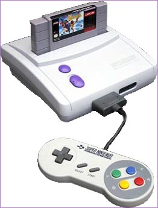
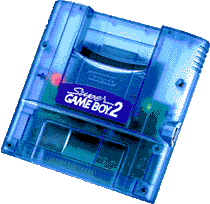
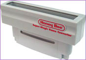
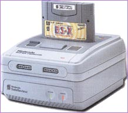
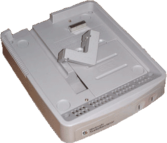
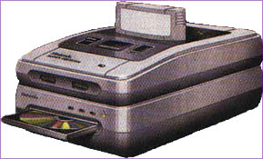

La reine des consoles de la génération des 16 bits, une suprématie incontestée grâce à des titres comme Super Mario World, Super Mario Kart, Zelda: A Link to the Past et bien sur le Mythique jeu de baston de l'époque Street Ficghter 2. Elle nous a aussi offert en fin de vie des titres d'exception comme Final Fantasy 6 et Chrono Trigger. Noter que la fin de la Super NES marque le fin du règne sans partage (en tant que constructeur de hardware) de Nintendo sur le monde du jeu vidéo.

---

# Contexte et histoire de la console

La SNES débarque dans un marché avec peu de concurrence en 1990 au japon (1991 aux US), deux ans après la Megadrive / Genesis. Malgré ce "retard" (les NES et Game Boy se vendaient encore très bien), la nouvelle console de Nintendo fit un carton. Il existait 3 versions : la Super NES en Amérique du Nord (apparence carrée, blanche et violette), la Super Famicon au Japon (plus arrondie) et la Super Nintendo en Europe telle que nous la connaissons.
La Super Nintendo supplanta la Megadrive de par ses capacités techniques, seule l'Angleterre ayant préféré la Megadrive à la console de Nintendo. Une version redessinée, plus petite de la console fut commercialisée en attendant la Nintendo 64 qui se faisait désirer.

# Accessoires

## Super Scope

En forme de bazooka, même utilisation que le pistolet sur la NES mais très peu de jeux utilisèrent le principe. Une cartouche de 6 jeux étaient fournie avec et d'après ce qui s'en dit, l'utilisation de cet accessoire se révélait très inconfortable et douloureuse pour l'épaule.

## La souris

Utilisée dans Mario Paint et dans quelques autres jeux.

## Super Game Boy

Permettait de jouer à ses jeux game boy en couleur sur sa SNES. Ce Super Game Boy avait la forme d'une cartouche traditionnelle avec un endroit évidé pouvant contenir la cartouche Game Boy.
Une deuxième version sortit en 1995 (ou 1998, à vous de me le dire). De couleur translucide, elle permettait cette fois d'utiliser le Câble Link. On pouvait donc relier le Super Game Boy 2 à sa propre Game Boy pour jouer à plusieurs.
Ce fut le succès de Pocket Monsters (maintenant nommé Pokémon) qui poussa à la commercialisation de ce produit. Malheureusement (ou heureusement ?), il ne sortit qu'au Japon.

## Adapteurs

Les cartouches européennes, japonaises et américaines avaient des formats différents. Cet adaptateur permettait de palier à ce problème. Un autre type d'adaptateur différent a également vu le jour mais il fallait posséder à la fois la cartouche européenne et la cartouche étrangère.

# L'ovni Satellaview

Vous n’avez jamais tenté de regarder sous votre super NES ? Une connectique était prévue pour y emboîter une extension : le Satellaview. Le même principe a été gardé sur la N64 pour le 64DD. Le point commun est que ces supports ne sortiront jamais ailleurs qu’au Japon.
Pour en revenir au Satellaview, ce système permettait de télécharger des jeux par des signaux télé (sur la chaine japonaise St GIGA). On pouvait même aller dans des magasins, charger les jeux sur des cartouches vierges et y jouer chez soi. Le tout pour 7.5€.
A ce prix là, ce n’étaient pas tous des jeux complets mais souvent des jeux en épisodes. Tel était le cas de BS Zelda, reprise du premier Zelda sur NES, dont les donjons étaient débloqués au fur et à mesure par Nintendo.
Cette aventure fut stoppée prématurément suite à l’échec de Sega et du Mega-CD et cela, malgré le fort soutien de Square et Nintendo.

# Super NES Playstation

Ce projet de console avec un support CD était déjà né avant que la conception de la Super Nintendo ne soit commencée ! Sony et Nintendo s'étaient déjà associés pour la puce audio de la SNES. Cette fois, Sony était chargé de la conception du module CD mais deux problèmes se posèrent. Le premier : Philips s'est mélé de l'histoire et un contencieux s'est créé entre les 3 firmes. Deuxième problème : Sony voulait également produire la console mais en "tout en 1", en plus de l'extension que constituait le module CD.
Le projet tomba donc à l'eau et Sony décida tout de même de rentabiliser sa recherche en commercialisant SA console que tout le monde connaît.

# Meilleurs jeux, les plus vendus

Super Mario World
Premier jeu disponible, un hit ! Un pack contenant la console & le jeu a été édité.
* Street Fighter II  
Grâce au succès du jeu en arcade. A également bénéficié d’un pack.
* Super Mario Kart  
Principe de jeu fun et délirant, maintes fois copié.
* Zelda : A Link to the Past  
Un des meilleurs, voir le meilleur, jeu de la saga.
* Super Metroid
* Secret of Mana
* Tales of Phantasia
* Donkey Kong Country

# Anecdotes et chiffres

* **46 millions** de consoles vendues dans le monde, contre 36 millions pour la N64
* un catalogue de plus de **700 jeux**
* **300 000 ventes** de console en quelques jours après le lancement.
